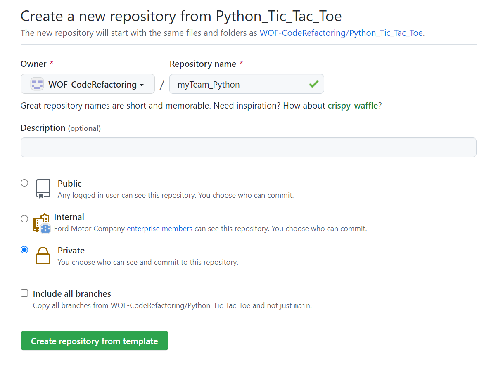

# Tic-tac-toe

This is an interactive Tic-tac-toe game that can be played by 2 players.

## How to Submit

- Create a repo(private) using this repo as template in this organization itself
  - repo name should be your Team/nick name followed by Language you choose ex: myTeam_Python
- Complete the refactorings and commit your code on the new repo created by you



## Run Locally

Clone the project

```bash
  git clone https://github.ford.com/WOF-CodeRefactoring/Python_Tic_Tac_Toe.git
```

To play the game

```bash
  cd Python_Tic_Tac_Toe
  python tic_tac_toe_game.py
```

To run the tests

```bash
  cd Python_Tic_Tac_Toe
  python test_tic_tac_toe.py
```

## Game Rules

- Two users can play the Game
- At the start of the game player-1 is asked to choose either 'X' or '0'. And then player-2 is assigned whatever player-1 didn't choose
- Alternatively each player is asked to enter the row and the column where they want to mark 'X' or '0'
- Row and column can either be 0, 1 or 2
- All the inputs are validated. If a player enters invalid row/column number then player is asked to enter valid no or if player entered a cell number that is already occupied player is asked for input again
- Each game end in a win(a lose for other player) or a draw if all cells are filled

## Refactoring Opportunities

- Everything is put in a single file as a function
- An external package (copy) is used to create copy of object. We can remove it and write our own implementation for creating copy of objects
- Seperate class files can be created (SRP principle)
- Tests can also be added (sanity test for test setup already present)

## Scope for improvements
- Currently the game supports 2 players. It can be extended for single_player vs computer_player (extra 2 points)
- It is an extension after creating single_player vs computer_player game. Computer can think of all of its steps and decide on which step will be closest to the winning scenario. So the ultimate goal is to create unbeatable computer player for tic-tac-toe game (extra 5 points)
- Currently the game runs in command line. Some better GUI (graphical user interface) can be added to improve playing experience (extra 3 points)
